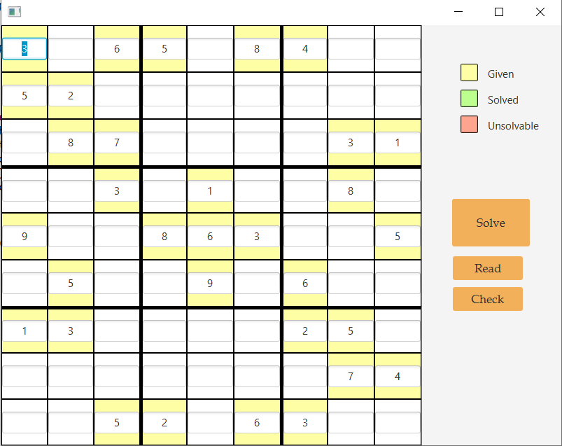
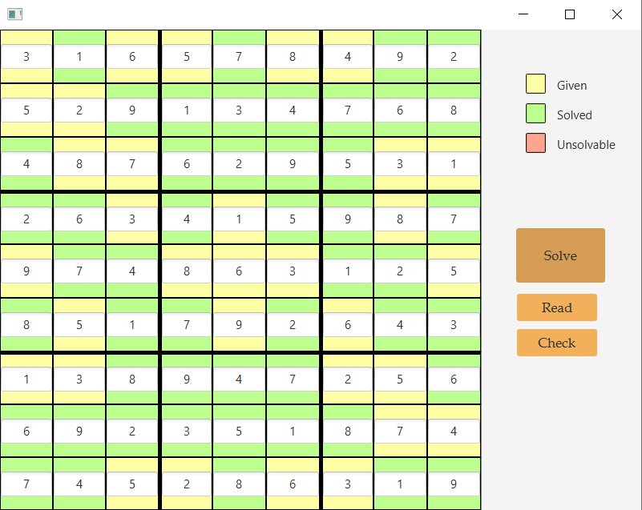

 <h1>Sudoku Game and Solver</h1>
  
This project is a Java-based application that allows users to play Sudoku and solve Sudoku puzzles using Scene Builder for the graphical user interface.

  <h2>Features</h2>
  <ul>
    <li>Sudoku Game: Play the classic Sudoku game with an interactive user interface.</li>
    <li>Solver Algorithm: Utilize an efficient Sudoku solver algorithm to solve any valid Sudoku puzzle.</li>
    <li>Scene Builder Integration: The graphical user interface is designed using Scene Builder, providing a visually appealing and intuitive experience.</li>
  </ul>

  

  
  

